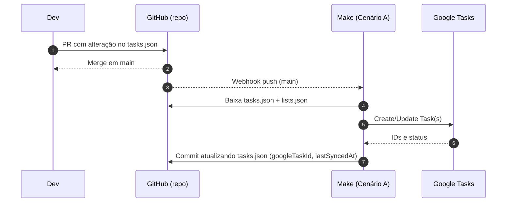
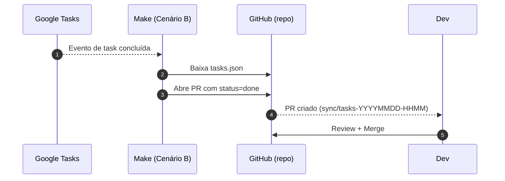

# /.planning — README

Este diretório concentra **o plano de trabalho versionado** do projeto. Aqui ficam os artefatos que descrevem tarefas, responsáveis e datas, servindo como **Fonte de Verdade** para automações (Make) que sincronizam o planejamento com **Google Tasks** e com atividades do **GitHub**.

> **Resumo:**
>
> * Edite o `tasks.json` e faça PR. Ao entrar em `main`, o Make cria/atualiza as tarefas no Google Tasks e devolve os `googleTaskId` no próprio arquivo.
> * Quando alguém concluir uma tarefa no Google Tasks, o Make abre um **PR** atualizando o `tasks.json` (mantendo o Git como fonte de verdade).

---

## Estrutura de arquivos

```
/.planning/
  ├─ tasks.json        # Plano de tarefas (Fonte de Verdade)
  ├─ lists.json        # Mapeia e-mails → listas do Google Tasks
  ├─ schema.tasks.json # (opcional) JSON Schema para validar tasks.json
  ├─ schema.lists.json # (opcional) JSON Schema para validar lists.json
  ├─ report.md         # (opcional) relatórios gerados pelo Make
  └─ README.md         # este arquivo
```

---

## Formato dos arquivos

### 1) `lists.json`

Mapeia **qual lista do Google Tasks** será usada por responsável.

```json
{
  "defaultListId": "MDk5MjM...c0Qx",
  "assignees": {
    "talita@exemplo.com": "MDEzNj...Y3Q2",
    "equipe@exemplo.com": "MDQ0Ng...RzQ4"
  }
}
```

**Regras:**

* Use `defaultListId` para fallback quando `assigneeEmail` não existir no mapa.
* IDs de lista podem ser obtidos pela própria API/módulo do Google Tasks no Make.

### 2) `tasks.json`

Plano estruturado de tarefas.

```json
{
  "version": 1,
  "lastSyncedAt": "2025-08-16T12:00:00Z",
  "epic": "Revisão Serverless",
  "tasks": [
    {
      "id": "T-001",
      "title": "Corrigir idempotência no SaveChatHistory",
      "description": "Adicionar messageId + ConditionExpression.",
      "status": "todo",             
      "priority": "high",           
      "assigneeEmail": "talita@exemplo.com",
      "due": "2025-08-20",         
      "labels": ["backend", "dynamo"],
      "googleTaskId": null,          
      "githubIssue": 128,            
      "createdAt": "2025-08-15T10:30:00Z",
      "updatedAt": "2025-08-16T11:05:00Z"
    }
  ]
}
```

**Campos e convenções:**

* `id` (**obrigatório**): estável e único (ex.: `T-123`). **Não renomeie**; crie novo ID.
* `status`: `todo` | `doing` | `done`. (O Make traduz para o Google Tasks: `needsAction`/`completed`).
* `priority`: `low` | `medium` | `high` | `critical`.
* `assigneeEmail`: e-mail usado em `lists.json` para escolher a lista.
* `due`: **YYYY-MM-DD** (Google Tasks ignora horário; use somente a data).
* `labels`: *tags* livres; use caixa baixa e `-` para múltiplas palavras (ex.: `observability`).
* `googleTaskId`: preenchido pelo Make após criar a task no Google.
* `githubIssue`: (opcional) número do issue/PR.
* `createdAt`/`updatedAt`: ISO 8601 UTC.
* `lastSyncedAt`: carimbo do último sync bem-sucedido.

---

## Fluxos de sincronização (Make)

### Cenário A — **Git → Google Tasks** (webhook/push em `main`)

1. Webhook do GitHub (evento `push`) dispara o Make quando `/.planning/tasks.json` muda no `main`.
2. O Make lê `tasks.json` e `lists.json` do repositório.
3. Para cada tarefa:

   * Se **não** houver `googleTaskId` → **cria** no Google Tasks (lista do `assigneeEmail`) e grava o ID retornado.
   * Se houver `googleTaskId` → **atualiza** título/notas/due/status.
4. O Make **commita de volta** o `tasks.json` com os `googleTaskId` e `lastSyncedAt` atualizados.

### Cenário B — **Google Tasks → Git** (watch/PR de volta)

1. O Make monitora as listas configuradas.
2. Ao detectar **conclusão** de uma task (status `completed`):

   * Localiza a tarefa correspondente pelo `googleTaskId` em `tasks.json`.
   * Atualiza `status` para `done` e `lastSyncedAt`.
   * Abre um **Pull Request** alterando o `tasks.json` (branch `sync/tasks-YYYYMMDD-HHMM`).

> **Fonte de Verdade:** `main`. O fluxo de volta pelo PR evita conflitos e mantém histórico revisável.

---

## Diagramas (Mermaid)





---

## Como contribuir

1. **Crie uma branch** a partir de `main`.
2. **Edite `tasks.json`** (respeitando o schema e as convenções).
3. **Abra PR** com título começando por `planning:` (ex.: `planning: adicionar tarefas de observability`).
4. Aguarde aprovação e merge. O Cenário A cuidará da criação/atualização no Google Tasks.

**Boas práticas**

* Evite mudar `id`; se necessário, **crie outra tarefa** e feche a anterior como `done`.
* Prefira PRs pequenos (até 10 tarefas por PR) para facilitar revisão.
* Preencha `assigneeEmail` sempre que possível para distribuir listas corretamente.

---

## Validação automática (opcional, recomendado)

Use um **GitHub Action** para validar o `tasks.json` e formatar JSON.

```yaml
# .github/workflows/validate-planning.yml
name: Validate planning
on:
  pull_request:
    paths:
      - '.planning/tasks.json'
      - '.planning/lists.json'
jobs:
  validate:
    runs-on: ubuntu-latest
    steps:
      - uses: actions/checkout@v4
      - name: Setup Node
        uses: actions/setup-node@v4
        with:
          node-version: '20'
      - name: Install deps
        run: |
          npm i -g ajv-cli jsonlint
      - name: Lint JSON
        run: |
          jsonlint -q .planning/tasks.json
          jsonlint -q .planning/lists.json
      - name: Validate Schema (se existir)
        run: |
          if [ -f .planning/schema.tasks.json ]; then ajv validate -s .planning/schema.tasks.json -d .planning/tasks.json; fi
          if [ -f .planning/schema.lists.json ]; then ajv validate -s .planning/schema.lists.json -d .planning/lists.json; fi
```

---

## JSON Schemas (sugestões)

### `schema.tasks.json`

```json
{
  "$schema": "http://json-schema.org/draft-07/schema#",
  "type": "object",
  "required": ["version", "tasks"],
  "properties": {
    "version": {"type": "integer", "minimum": 1},
    "lastSyncedAt": {"type": "string", "format": "date-time"},
    "epic": {"type": "string"},
    "tasks": {
      "type": "array",
      "items": {
        "type": "object",
        "required": ["id", "title", "status"],
        "properties": {
          "id": {"type": "string", "pattern": "^T-[0-9A-Za-z_-]+$"},
          "title": {"type": "string", "minLength": 3},
          "description": {"type": "string"},
          "status": {"type": "string", "enum": ["todo", "doing", "done"]},
          "priority": {"type": "string", "enum": ["low", "medium", "high", "critical"]},
          "assigneeEmail": {"type": "string", "format": "email"},
          "due": {"type": "string", "pattern": "^\\d{4}-\\d{2}-\\d{2}$"},
          "labels": {
            "type": "array",
            "items": {"type": "string"}
          },
          "googleTaskId": {"type": ["string", "null"]},
          "githubIssue": {"type": ["integer", "null"]},
          "createdAt": {"type": "string", "format": "date-time"},
          "updatedAt": {"type": "string", "format": "date-time"}
        },
        "additionalProperties": false
      }
    }
  },
  "additionalProperties": false
}
```

### `schema.lists.json`

```json
{
  "$schema": "http://json-schema.org/draft-07/schema#",
  "type": "object",
  "required": ["defaultListId", "assignees"],
  "properties": {
    "defaultListId": {"type": "string", "minLength": 5},
    "assignees": {
      "type": "object",
      "additionalProperties": {"type": "string"}
    }
  },
  "additionalProperties": false
}
```

---

## Perguntas frequentes (FAQ)

**1) Posso editar tarefas direto no Google Tasks?**
Pode, mas alterações fora “concluir” serão propostas via **PR** para o Git (Cenário B). O `main` é a fonte de verdade.

**2) O que acontece se eu renomear `id`?**
Será tratado como **nova tarefa**. Use `updatedAt`/`title` para mudanças de texto; mantenha `id` estável.

**3) Como obtenho o `defaultListId`?**
Crie uma tarefa manualmente na lista alvo e capture o ID pelo módulo do Google Tasks no Make ou via API.

**4) E se uma tarefa trocar de responsável?**
Atualize `assigneeEmail`. No próximo sync, o Make migrará/atualizará na lista do novo responsável.

**5) Campos extras no JSON quebram?**
Se o schema estiver ativo, PRs com campos não previstos falharão na validação. Ajuste o schema antes.

---

## Roadmap (e ideias futuras)

* Integração de **Issues/PRs** automaticamente nas notas da task.
* Geração de **report.md** semanal com progresso (Make → commit).
* Campo `dependsOn` entre tarefas para ordenar execução.
* Sincronizar `priority` com marcações visuais no Google Tasks.

---

## Licença e responsabilidade

Este diretório contém metadados operacionais. Não incluir segredos. IDs de listas do Google não são sensíveis, mas tratá-los como **dados internos**.
