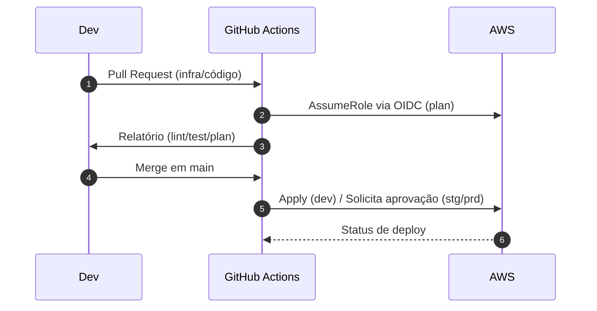

# AletheIA — Plataforma de Investigação de Problemas com IA (AWS Serverless)

> **Status**: Software **proprietário** — consulte **LICENSE.md** (uso restrito; todos os direitos reservados).
>
> **Missão**: descobrir, explicar e resolver problemas com agentes de IA colaborativos, streaming em tempo real e orquestração serverless — com segurança, observabilidade e FinOps desde o dia 1.
> **Nome***: AletheIA (do grego "verdade", "realidade") reflete a busca pela verdade em investigações complexas.

---

## 📌 Sumário

* [Visão geral](#visão-geral)
* [Arquitetura (alto nível)](#arquitetura-alto-nível)
* [Estrutura do repositório](#estrutura-do-repositório)
* [Pré-requisitos](#pré-requisitos)
* [Configuração inicial](#configuração-inicial)
* [Infra como código (Terraform)](#infra-como-código-terraform)
* [CI/CD (GitHub Actions)](#cicd-github-actions)
* [Segurança](#segurança)
* [Desenvolvimento local](#desenvolvimento-local)
* [Testes](#testes)
* [Observabilidade & FinOps](#observabilidade--finops)
* [Planejamento & Tarefas](#planejamento--tarefas)
* [Política de branches e commits](#política-de-branches-e-commits)
* [Checklist de PR (DoD)](#checklist-de-pr-dod)
* [Matriz de variáveis de ambiente](#matriz-de-variáveis-de-ambiente)
* [Operação e incidentes](#operação-e-incidentes)
* [Base de conhecimento “AI‑friendly”](#base-de-conhecimento-ai-friendly)
* [Roadmap](#roadmap)
* [Contribuição](#contribuição)
* [Licença](#licença)

---

## Visão geral

A **AletheIA** é um sistema de **investigação assistida por IA**. A experiência do usuário é um chat **tempo real** (WebSocket) que conduz a entrevista, consolida contexto, prioriza causas e propõe planos de ação. O backend é **serverless** na AWS, com **Step Functions** orquestrando etapas, **Lambdas** para conexão/stream/persistência e **DynamoDB** como armazenamento de histórico.

**Capacidades**

* Streaming **token‑a‑token** via API Gateway **WebSocket**.
* Orquestração de prompts/etapas com **AWS Step Functions**.
* Persistência de conversas/mensagens (DynamoDB) com **idempotência** e **ordenamento**.
* Integração com LLMs (OpenAI e/ou **Amazon Bedrock**).
* Observabilidade completa (logs JSON + **X‑Ray** + métricas de negócio).
* **FinOps** (métrica de custo por conversa, budgets e alarmes).

---

## Arquitetura (alto nível)

```mermaid
flowchart LR
  subgraph Client[Browser / Frontend]
    UI[Chat UI]
  end

  subgraph AWS[AWS]
    APIGW[API Gateway WebSocket]
    LConnect((Lambda $connect))
    LDisc((Lambda $disconnect))
    LChunk((Lambda GenerateChunk))
    LSave((Lambda SaveChatHistory))
    SFN{{Step Functions\nWebSocketResponder}}
    DDB[(DynamoDB\nConversas/Mensagens/Conexões)]
    S3[S3 Static Website]
    SM[Secrets Manager / Parameter Store]
    CW[CloudWatch + X-Ray]
    EVB[EventBridge\n(alarms/budgets)]
  end

  UI <-- WS --> APIGW
  APIGW --> LConnect
  APIGW --> LDisc
  APIGW --> LChunk
  LChunk --> SFN
  LChunk -->|isFinal| LSave
  SFN --> LSave
  LSave --> DDB
  UI -.->|GET| S3
  LChunk -.-> SM
  LSave -.-> SM
  AWS -.-> CW
  EVB -.-> SFN
```

**Contrato de mensagem (WS)**

```json
{
  "messageType": "chunk|final|system|error",
  "messageId": "uuid",
  "sequence": 12,
  "chunkIndex": 3,
  "isFinal": false,
  "correlationId": "conversation-uuid",
  "role": "user|assistant|system",
  "payload": { "text": "..." }
}
```

---

## Estrutura do repositório

```text
/
├─ .github/
│  ├─ workflows/                 # ci.yml, tf-plan.yml, tf-apply.yml, security.yml
│  ├─ CODEOWNERS
│  └─ PULL_REQUEST_TEMPLATE.md
│
├─ .planning/                    # planejamento versionado (tasks.json, lists.json, README)
│
├─ infra/
│  └─ terraform/
│     ├─ modules/
│     │  ├─ api_gateway_ws/
│     │  ├─ lambda_function/
│     │  ├─ dynamodb_tables/
│     │  ├─ step_functions/
│     │  ├─ s3_static_website/
│     │  ├─ observability/
│     │  └─ iam_oidc_github/
│     └─ envs/
│        ├─ dev/ (main.tf, backend.tf, variables.tf)
│        ├─ stg/
│        └─ prd/
│
├─ services/
│  ├─ ws-connection/ (ConnectFunction.js, disconnectWS.js, tests/)
│  ├─ chat-stream/ (GenerateChunk.js, PreparePrompt.js, SaveChatHistory.js, tests/)
│  └─ orchestration/ (snippets, contratos, testes ASL)
│
├─ frontend/
│  └─ web/ (public/index.html, src/, tests/)
│
├─ docs/ (architecture/, operations/, security/, finops/)
├─ kb/   (conteúdo curto “AI‑friendly” com front‑matter)
├─ scripts/
├─ .editorconfig
├─ .gitignore
├─ .gitattributes
└─ README.md (este arquivo)
```

---

## Pré-requisitos

* **AWS**: conta e permissões para criar recursos serverless.
* **Terraform ≥ 1.6**, **AWS CLI v2**.
* **Node.js ≥ 20** (e linguagens extras conforme cada serviço).
* **GitHub Actions** habilitado (OIDC para assumir Role na AWS).

---

## Configuração inicial

1. **State remoto do Terraform**: S3 (versionado) + DynamoDB (lock).
2. **Role OIDC**: módulo `iam_oidc_github` (trust para este repositório).
3. **Secrets/Parameters** (OpenAI/Bedrock etc.) em **AWS Secrets Manager/SSM**.
4. **Buckets/Tabelas** conforme módulos (S3 website, DynamoDB conversas/mensagens/conexões com TTL).

> Nunca commite segredos. O CI assume role via OIDC e lê segredos **somente** em `deploy`.

---

## Infra como código (Terraform)

Ambientes em `infra/terraform/envs/{dev,stg,prd}`.

```bash
cd infra/terraform/envs/dev
terraform init   # usa backend S3/Dynamo
terraform plan -out=tfplan
terraform apply tfplan
```

Variáveis sensíveis → SSM/Secrets; não sensíveis → `*.tfvars` por ambiente.

---

## CI/CD (GitHub Actions)

* **ci.yml**: lint/test/build por serviço; cobertura mínima.
* **tf-plan.yml**: `terraform plan` em PRs (dev); artefato `tfplan` publicado.
* **tf-apply.yml**: `apply` via **environment** com **aprovação** (stg/prd).
* **security.yml**: scanners (secret scan, deps, SAST).

**Fluxo**



---

## Segurança

* **Sem segredos no repo** (SM/SSM). Branch protection + CODEOWNERS + status checks.
* **Least‑Privilege** por Lambda/estado SFN; políticas com `Resource` específico.
* **Criptografia** (KMS) em dados/ambiente; mascaramento de PII nos logs.
* **TTL** para conexões/itens temporários; *rate limits* e **concorrência** por função.
* (Opcional) **WAF/Shield** no API Gateway público e restrição de origem.

---

## Desenvolvimento local

* **Frontend**: `frontend/web` → seu dev server.
* **Lambdas**: testes unitários com mocks do SDK AWS. Empacote com scripts em `/scripts`.
* **Emuladores** (opcional): DynamoDB Local, Step Functions Local.

**Convenções**

* **Conventional Commits** (`feat:`, `fix:`, `chore:` …) e PRs pequenos.
* **ADRs** curtos em `docs/architecture/decisões/`.
* Lint/format obrigatórios no CI.

---

## Testes

* **Unitários** por serviço (`/services/*/tests`).
* **Integração**: WebSocket (connect→send→chunks→final), Step Functions (caminhos), DynamoDB (idempotência/TTL).
* **E2E**: conversa → persistência → métricas.
* **Critérios**: cobertura mínima acordada; TTFT P95, erro de streaming ≤ 1%, duplicatas=0 em replays.

---

## Observabilidade & FinOps

* **Logs JSON** com `correlationId` e `messageId` + **X‑Ray**.
* **Dashboards** técnicos e **métricas de negócio** (TTFT, conclusão, erro de streaming, custo por conversa via EMF).
* **Budgets & alarms** (CloudWatch/AWS Budgets) com notificações.

---

## Planejamento & Tarefas

O planejamento versionado vive em **`/.planning`**:

* `README.md`: como funciona a sincronização via **Make** com **Google Tasks**.
* `tasks.json`: lista priorizada e datada.
* `lists.json`: mapa de e‑mails → listas do Google Tasks.

> O **Git** (branch `main`) é a **fonte de verdade**. Alterações no Google Tasks geram **PR** de volta.

---

## Política de branches e commits

* **Branches**: `main` (estável), `feat/*`, `fix/*`, `chore/*`, `docs/*`, `infra/*`.
* **Commits** (Conventional): `feat:`, `fix:`, `refactor:`, `perf:`, `test:`, `docs:`, `build:`, `ci:`, `chore:`.
* **PRs pequenos** (≤ 400 linhas úteis) e focados em um objetivo.
* **Proteções**: `main` com revisão obrigatória, checks de CI e bloqueio de *force‑push*.

---

## Checklist de PR (DoD)

1. **Compila/Testa** localmente e no CI (verde).
2. **Cobertura** ≥ 80% no serviço afetado.
3. **Logging** consistente (JSON com `correlationId`/`messageId`).
4. **IAM** sem curingas; variáveis sensíveis **não** commitadas.
5. **Docs** atualizadas (`/docs` ou `/kb`) quando houver mudança de contrato/fluxo.
6. **Planejamento**: se criar/alterar esforço, atualize `/.planning/tasks.json`.

---

## Matriz de variáveis de ambiente

> Valores sensíveis devem vir de **Secrets Manager**/SSM; abaixo, **nomes** esperados e finalidade.

### `services/chat-stream`

| Variável                                                       | Finalidade              | Sensível |
| -------------------------------------------------------------- | ----------------------- | -------- |
| `WS_ENDPOINT`                                                  | Post no API GW WS       | Não      |
| `MODEL_ID`                                                     | LLM alvo                | Não      |
| `OPENAI_API_KEY` / `BEDROCK_*`                                 | Credenciais de modelo   | **Sim**  |
| `TABLE_CONVERSATIONS` / `TABLE_MESSAGES` / `TABLE_CONNECTIONS` | Tabelas DDB             | Não      |
| `STREAM_CHUNK_MS`                                              | Throttle de envio       | Não      |
| `LOG_LEVEL`                                                    | `INFO/DEBUG/WARN/ERROR` | Não      |

### `services/ws-connection`

| Variável            | Finalidade                  | Sensível |
| ------------------- | --------------------------- | -------- |
| `CONNECTIONS_TABLE` | Tabela de conexões WS (TTL) | Não      |
| `ALLOWED_ORIGINS`   | Controle simples de origem  | Não      |

> Documente variáveis adicionais por serviço no respectivo `README.md`.

---

## Operação e incidentes

* **Severidades**: S1 (indisponibilidade ampla), S2 (degradação), S3 (falha parcial), S4 (cosmético).
* **Resposta**: abertura de incidente, canal dedicado, *owner* claro, atualização a cada 30–60 min.
* **Pós‑mortem leve** (≤ 1 página): causa raiz, ações corretivas, prevenção.

---

## Base de conhecimento “AI‑friendly”

* Arquivos em `/kb` com **front‑matter** YAML:

  ```md
  ---
  title: "Contrato de Mensagens WS"
  tags: ["websocket","streaming","frontend"]
  service: "chat-stream"
  updated_at: "2025-08-16"
  ---
  ```
* Um tópico por arquivo, exemplos curtos, decisões e links cruzados.

**Links úteis**: `docs/architecture/` (visão e ADRs); `services/*/README.md`; `infra/terraform/`; `/.planning`.

---

## Roadmap

* **Stream direto** Lambda→WS (SFN apenas para orquestrações macro).
* **Idempotência plena** em `SaveChatHistory` e schema DDB formal (PK/SK + GSI por e‑mail hash + TTL).
* **Métricas de custo por conversa** via EMF + orçamento/alarme.
* **WAF/Shield** (se público) e *rate limiting* no WS.
* **Testes de caos** (rede, throttling, cold starts) automatizados.

---

## Contribuição

1. Crie branch a partir de `main`.
2. Siga **Conventional Commits**.
3. Abra PR com o **checklist** preenchido.
4. Aguarde CI verde e **review**.
5. *Merge* via **squash**.

---

## Licença

Este repositório é **fechado**. A leitura do código **não** confere licença de uso. Consulte **LICENSE.md** para termos e para o procedimento de **licenciamento comercial**.
