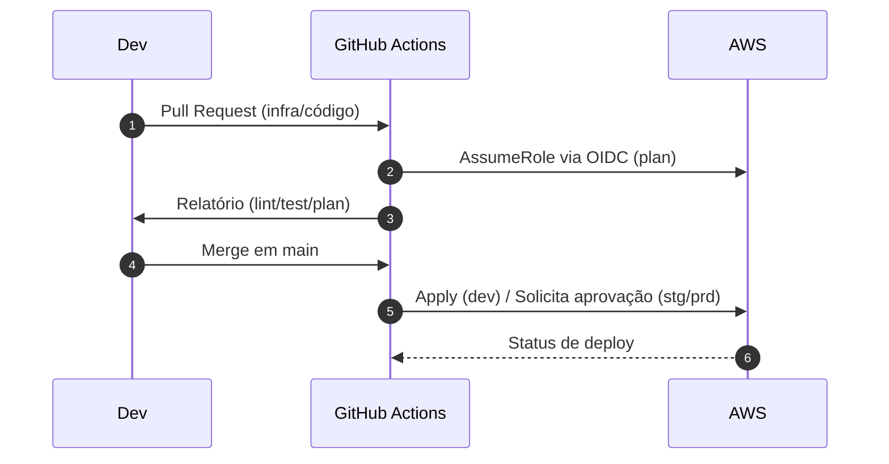

# AletheIA — Plataforma de Investigação de Problemas com IA (AWS Serverless)

> **Missão**: descobrir, explicar e resolver problemas com agentes de IA colaborativos, streaming em tempo real e orquestração serverless — com segurança, observabilidade e FinOps desde o dia 1.

---

## 📌 Sumário

* [Visão geral](#visão-geral)
* [Arquitetura (alto nível)](#arquitetura-alto-nível)
* [Estrutura do repositório](#estrutura-do-repositório)
* [Pré-requisitos](#pré-requisitos)
* [Configuração inicial](#configuração-inicial)
* [Infra como código (Terraform)](#infra-como-código-terraform)
* [CI/CD (GitHub Actions)](#cicd-github-actions)
* [Segurança](#segurança)
* [Desenvolvimento local](#desenvolvimento-local)
* [Testes](#testes)
* [Observabilidade & FinOps](#observabilidade--finops)
* [Planejamento & Tarefas](#planejamento--tarefas)
* [Contribuição](#contribuição)
* [Licença](#licença)

---

## Visão geral

A **AletheIA** é um sistema de **investigação assistida por IA**. A experiência do usuário é um chat **tempo real** (WebSocket) que conduz a entrevista, consolida contexto, prioriza causas e propõe planos de ação. O backend é **serverless** na AWS, com **Step Functions** orquestrando etapas, **Lambdas** para conexão/stream/persistência e **DynamoDB** como armazenamento de histórico.

**Capacidades principais**

* Streaming **token‑a‑token** via API Gateway **WebSocket**.
* Orquestração de prompts/etapas com **AWS Step Functions**.
* Persistência de conversas/mensagens (DynamoDB) com **idempotência** e **ordenamento**.
* Integração com LLMs (OpenAI e/ou **Amazon Bedrock**).
* Observabilidade completa (logs JSON + **X‑Ray** + métricas de negócio).
* **FinOps** (métrica de custo por conversa, budgets e alarmes).

---

## Arquitetura (alto nível)

```mermaid
flowchart LR
  subgraph Client[Browser / Frontend]
    UI[Chat UI]
  end

  subgraph AWS[AWS]
    APIGW[API Gateway WebSocket]
    LConnect((Lambda $connect))
    LDisc((Lambda $disconnect))
    LChunk((Lambda GenerateChunk))
    LSave((Lambda SaveChatHistory))
    SFN{{Step Functions\nWebSocketResponder}}
    DDB[(DynamoDB\nConversas/Mensagens/Conexões)]
    S3[S3 Static Website]
    SM[Secrets Manager / Parameter Store]
    CW[CloudWatch + X-Ray]
    EVB[EventBridge\n(alarms/budgets)]
  end

  UI <-- WS --> APIGW
  APIGW --> LConnect
  APIGW --> LDisc
  APIGW --> LChunk
  LChunk --> SFN
  LChunk -->|isFinal| LSave
  SFN --> LSave
  LSave --> DDB
  UI -.->|GET| S3
  LChunk -.-> SM
  LSave -.-> SM
  AWS -.-> CW
  EVB -.-> SFN
```

**Contrato de mensagem (WS)**

```json
{
  "messageType": "chunk|final|system|error",
  "messageId": "uuid",
  "sequence": 12,
  "chunkIndex": 3,
  "isFinal": false,
  "correlationId": "conversation-uuid",
  "role": "user|assistant|system",
  "payload": { "text": "..." }
}
```

---

## Estrutura do repositório

```text
/
├─ .github/
│  ├─ workflows/                 # ci.yml, tf-plan.yml, tf-apply.yml, security.yml
│  ├─ CODEOWNERS
│  └─ PULL_REQUEST_TEMPLATE.md
│
├─ .planning/                    # planejamento versionado (tasks.json, lists.json, README)
│
├─ infra/
│  └─ terraform/
│     ├─ modules/
│     │  ├─ api_gateway_ws/
│     │  ├─ lambda_function/
│     │  ├─ dynamodb_tables/
│     │  ├─ step_functions/
│     │  ├─ s3_static_website/
│     │  ├─ observability/
│     │  └─ iam_oidc_github/
│     └─ envs/
│        ├─ dev/
│        │  ├─ main.tf  # chama módulos
│        │  ├─ backend.tf  # S3 state + DynamoDB lock
│        │  └─ variables.tf
│        ├─ stg/
│        └─ prd/
│
├─ services/
│  ├─ ws-connection/
│  │  ├─ src/ (ConnectFunction.js, disconnectWS.js)
│  │  ├─ tests/
│  │  └─ README.md
│  ├─ chat-stream/
│  │  ├─ src/ (GenerateChunk.js, PreparePrompt.js, SaveChatHistory.js)
│  │  ├─ tests/
│  │  └─ README.md
│  └─ <svc-others>/  # microsserviços em Node/Python/Go, se necessário
│
├─ frontend/
│  └─ web/ (public/index.html, src/, tests/)
│
├─ docs/
│  ├─ architecture/ (visão-geral.md, ADRs, diagramas)
│  ├─ operations/ (playbooks, observabilidade.md)
│  ├─ security/ (iam-policies.md, dados-sensiveis.md)
│  └─ finops/ (custos-estimados.md, budgets-alertas.md)
│
├─ kb/                           # base “AI‑friendly” (MDs curtos com front‑matter)
├─ scripts/                      # utilitários (build, lint, empacote lambdas)
├─ .editorconfig
├─ .gitignore
├─ .gitattributes
└─ README.md                     # este arquivo
```

---

## Pré-requisitos

* **AWS**: conta e permissões para criar recursos serverless.
* **Terraform ≥ 1.6** e **AWS CLI v2**.
* **Node.js ≥ 20** (e linguagens extras conforme cada serviço).
* **GitHub Actions** habilitado no repositório (com **OIDC** para assumir Role na AWS).

---

## Configuração inicial

1. **State remoto do Terraform**: crie S3 (versionado) + DynamoDB (lock).
2. **Role OIDC para GitHub Actions**: módulo `iam_oidc_github` (trust para seu repo).
3. **Secrets/Parameters** (OpenAI/Bedrock e configs) no **AWS Secrets Manager/Parameter Store**.
4. **Buckets** (S3 website) e tabelas DynamoDB conforme módulos.

> Nunca commite segredos. O CI assume role via OIDC e lê segredos **somente** em `deploy`.

---

## Infra como código (Terraform)

**Ambientes**: `infra/terraform/envs/{dev,stg,prd}`.

```bash
cd infra/terraform/envs/dev
terraform init   # usa backend S3/Dynamo configurado em backend.tf
terraform plan -out=tfplan
terraform apply tfplan
```

Variáveis sensíveis → Parameter Store/Secrets; valores não sensíveis → `*.tfvars` por ambiente.

---

## CI/CD (GitHub Actions)

* **ci.yml**: lint/test/build por serviço; cobertura mínima.
* **tf-plan.yml**: `terraform plan` em PRs (dev). Artefato `tfplan` publicado.
* **tf-apply.yml**: `apply` via **environment** com **aprovação** (stg/prd).
* **security.yml**: scanners (secret scan, SAST), dependencia/bot.

**Fluxo**



---

## Segurança

* **Sem segredos no repo** (use SM/PS). Branch protection + CODEOWNERS + status checks.
* **Least‑Privilege** por função (Lambda, Terraform, workflows). Evite `*` em `Resource`.
* **Criptografia** (KMS) em dados/ambiente; mascaramento de PII em logs.
* **TTL** para conexões/itens temporários; rate limits e **concorrência** por função.
* (Opcional) **WAF** no API Gateway e Origin Policy no S3/CloudFront.

---

## Desenvolvimento local

* **Frontend**: `frontend/web` → qualquer dev server (ex.: `npm run dev`).
* **Lambdas**: testes unitários com mocks do SDK AWS. Empacote com scripts em `/scripts`.
* **Emuladores** (opcional): DynamoDB Local, Step Functions Local.

### Convenções

* **Conventional Commits** (`feat:`, `fix:`, `chore:` …) e PRs pequenos.
* **ADRs** curtos em `docs/architecture/decisões/`.
* Lint/format obrigatórios no CI.

---

## Testes

* **Unitários**: por serviço (`/services/*/tests`).
* **Integração**: WebSocket (conexão/reconexão/ordem de chunks), Step Functions (caminhos), DynamoDB (idempotência/TTL).
* **E2E**: fluxo conversa → persistência → métricas.
* **Critérios**: cobertura mínima acordada; TTFT P95, erro de streaming, duplicatas=0 em replays.

---

## Observabilidade & FinOps

* **Logs JSON** com `correlationId` e `messageId` + **X‑Ray**.
* **Dashboards** técnicos e **métricas de negócio** (TTFT, conclusão, erro de streaming, custo por conversa via EMF).
* **Budgets & alarms** (CloudWatch/AWS Budgets) com notificações.

---

## Planejamento & Tarefas

O planejamento versionado vive em **`/.planning`**:

* `README.md`: como funciona a sincronização via **Make** com **Google Tasks**.
* `tasks.json`: lista priorizada e datada.
* `lists.json`: mapa de e‑mails → listas do Google Tasks.

> O **Git** (branch `main`) é a **fonte de verdade**. Alterações no Google Tasks geram **PR** de volta.

---

## Contribuição

1. Crie uma **branch** a partir de `main`.
2. Faça **commits pequenos** e com **Conventional Commits**.
3. Abra **PR** com descrição clara e links (issue/diagramas/execução).
4. Aguarde **CI verde** (lint, testes, plan) e **review**.

**Definições**

* **DoR**: objetivo, critérios de aceite, impacto/esforço, rollback.
* **DoD**: testes OK, observabilidade configurada, docs/ADRs atualizadas, deploy realizado.

---

## Licença

Defina a licença do projeto (ex.: MIT, Apache‑2.0) e adicione o arquivo `LICENSE` na raiz.
