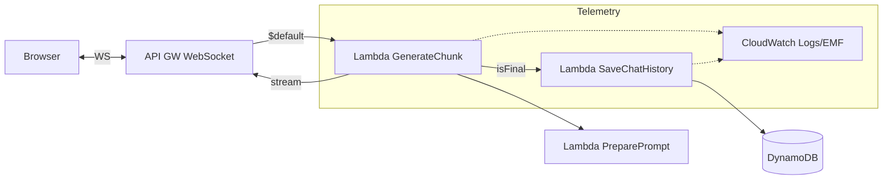
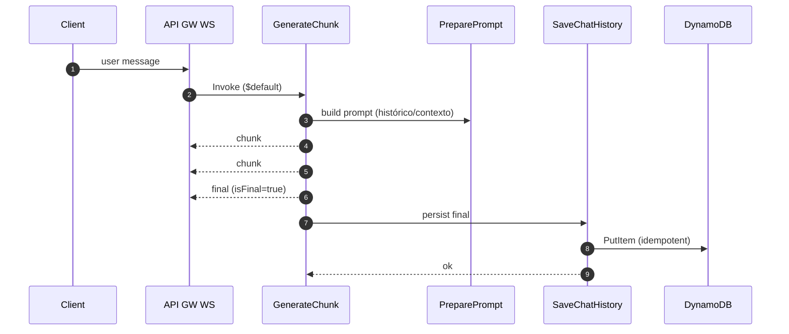
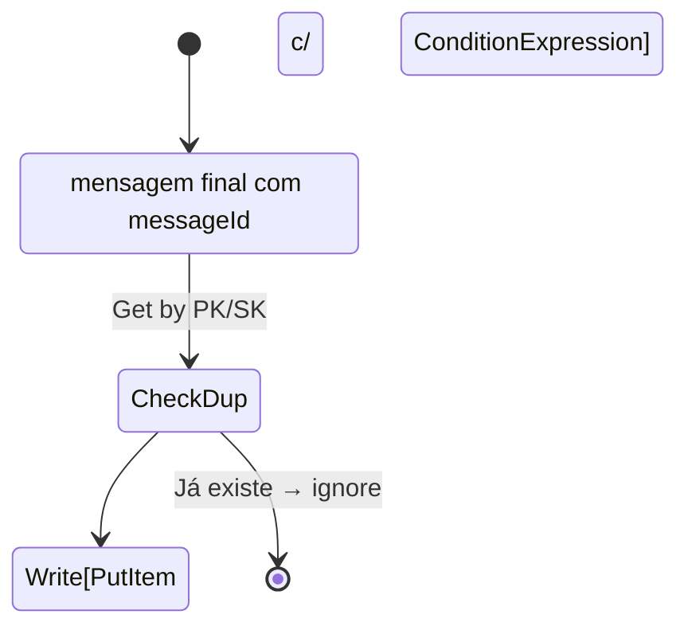

# services/chat-stream — README

Este serviço implementa a **linha de produção de mensagens** da AletheIA: prepara prompts, chama o(s) LLM(s) e faz o **streaming** de chunks via **API Gateway WebSocket**, além de persistir histórico quando `isFinal=true`.

> Principais Lambdas
>
> * `GenerateChunk` (streaming do modelo → WebSocket)
> * `PreparePrompt` (montagem de instruções/estado da conversa)
> * `SaveChatHistory` (persistência idempotente no DynamoDB)

---

## Sumário

* [Responsabilidades](#responsabilidades)
* [Arquitetura](#arquitetura)
* [Contrato de Mensagens (WS)](#contrato-de-mensagens-ws)
* [Fluxos (Mermaid)](#fluxos-mermaid)
* [Estrutura de pastas](#estrutura-de-pastas)
* [Ambiente & Configuração](#ambiente--configuração)
* [Executando localmente](#executando-localmente)
* [Testes](#testes)
* [Observabilidade](#observabilidade)
* [Segurança](#segurança)
* [Erros & Retentativas](#erros--retentativas)
* [CI/CD & Deploy](#cicd--deploy)
* [Tarefas Relacionadas](#tarefas-relacionadas)

---

## Responsabilidades

* **Preparar prompts** com contexto (histórico condensado, modo entrevista/geração, restrições).
* **Gerar saída** usando modelo (OpenAI/Bedrock) com suporte a *streaming token‑a‑token*.
* **Transmitir** via WebSocket (API Gateway) respeitando ordenação (`sequence`, `chunkIndex`) e marcadores de fim (`isFinal`).
* **Persistir** histórico de conversa/mensagens no DynamoDB **somente** no final (ou em checkpoints configuráveis).
* **Publicar métricas** (TTFT, tokens, custo estimado por conversa) via CloudWatch EMF.

Fora de escopo: autenticação de usuário final (delegado ao *edge/web*), billing/quotas globais.

---

## Arquitetura

* **Entrada**: mensagens do cliente via rota WS `$default` (API GW), eventos Step Functions e/ou EventBridge (opcional).
* **Compute**: Lambdas `GenerateChunk`, `PreparePrompt`, `SaveChatHistory` (Node.js 20.x).
* **Persistência**: DynamoDB (`Conversations`, `Messages`, `Connections`) com TTL para conexões e housekeeping.
* **Segredos**: AWS Secrets Manager/Parameter Store.
* **Observabilidade**: CloudWatch Logs (JSON), X‑Ray, métricas EMF.



---

## Contrato de Mensagens (WS)

**Cliente → Servidor** (exemplo de requisição):

```json
{
  "messageType": "user",
  "messageId": "3c2f...",
  "correlationId": "conv-7b1d...",
  "sequence": 21,
  "payload": { "text": "Explique o erro X" }
}
```

**Servidor → Cliente** (stream):

```json
{
  "messageType": "chunk",
  "messageId": "afe1...",
  "correlationId": "conv-7b1d...",
  "role": "assistant",
  "sequence": 22,
  "chunkIndex": 0,
  "isFinal": false,
  "payload": { "text": "Primeiro trecho..." }
}
```

**Mensagem final** (persistida):

```json
{
  "messageType": "final",
  "messageId": "afe1...",
  "correlationId": "conv-7b1d...",
  "role": "assistant",
  "sequence": 22,
  "chunkIndex": 7,
  "isFinal": true,
  "payload": { "text": "Resposta completa...", "usage": {"input": 512, "output": 896} }
}
```

> **Ordenação**: o front deve **bufferizar** por `sequence`/`chunkIndex` e só confirmar renderização quando o `isFinal` ou timeouts por etapa ocorrerem.

---

## Fluxos (Mermaid)

### 1) Geração e streaming



### 2) Persistência idempotente



---

## Estrutura de pastas

```
services/chat-stream/
  ├─ src/
  │  ├─ GenerateChunk.js
  │  ├─ PreparePrompt.js
  │  └─ SaveChatHistory.js
  ├─ tests/
  │  ├─ generateChunk.test.js
  │  ├─ preparePrompt.test.js
  │  └─ saveChatHistory.test.js
  ├─ package.json
  ├─ jest.config.js
  └─ README.md (este)
```

---

## Ambiente & Configuração

**Variáveis de ambiente (Lambda):**

* `WS_ENDPOINT` — endpoint do API GW (para postar mensagens).
* `TABLE_CONVERSATIONS` / `TABLE_MESSAGES` / `TABLE_CONNECTIONS` — nomes das tabelas DynamoDB.
* `OPENAI_API_KEY` **ou** `BEDROCK_*` — recuperado via **Secrets Manager/Parameter Store**.
* `MODEL_ID` — ex.: `gpt-4o-mini` / `anthropic.claude-3-haiku`.
* `STREAM_CHUNK_MS` — *throttle* opcional de envio.
* `LOG_LEVEL` — `INFO|DEBUG|WARN|ERROR`.

**Permissões (IAM) mínimas:**

* `dynamodb:PutItem`, `GetItem`, `Query` nas tabelas do serviço (chaves específicas).
* `execute-api:ManageConnections` no WS Endpoint.
* `secretsmanager:GetSecretValue` / `ssm:GetParameter` (paths restritos).
* X‑Ray: `xray:PutTraceSegments`, `PutTelemetryRecords`.

---

## Executando localmente

1. **Instalar deps**

   ```bash
   npm ci
   ```
2. **Variáveis** (arquivo `.env.local` apenas local, não comitar):

   ```env
   WS_ENDPOINT=wss://exemplo.amazonaws.com/dev
   MODEL_ID=gpt-4o-mini
   LOG_LEVEL=DEBUG
   ```
3. **Rodar testes**

   ```bash
   npm test
   ```
4. **Simular chamada** (node):

   ```bash
   node src/GenerateChunk.js < payload.json
   ```

> Para testes de integração WS, use um script em `tests/` que abra conexão, envie mensagem e valide chunks e `final`.

---

## Testes

* **Unitários (Jest)**: mocks do SDK AWS (DynamoDBClient, ApiGatewayManagementApi), validação de schema do contrato, montagem correta de prompts, cálculo de `sequence/chunkIndex`.
* **Integração**: fluxo WS (connect→send→chunks→final), Step Functions (se usado), idempotência em `SaveChatHistory`.
* **Cobertura mínima**: 80% linhas/branches.

---

## Observabilidade

* **Logs JSON** com `correlationId`, `messageId`, `role`, `latencyMs`, `tokensIn/out`, `costEstimate`.
* **Métricas EMF**: `TTFT`, `ChunksPerMsg`, `Errors`, `CostPerConversation`.
* **Tracing X‑Ray**: anotar subsegmentos para chamadas a LLM e DynamoDB.

Exemplo de log:

```json
{
  "level":"INFO",
  "msg":"chunk_sent",
  "correlationId":"conv-7b1d...",
  "messageId":"afe1...",
  "sequence":22,
  "chunkIndex":1,
  "latencyMs":142
}
```

---

## Segurança

* **Sem segredos no código**: sempre via Secrets Manager/Parameter Store.
* **PII**: hash+salt para chaves de usuário; mascarar PII em logs.
* **Least‑Privilege**: policies específicas por função.
* **Rate Limits**: controlar concorrência da Lambda; validar tamanho do payload.

---

## Erros & Retentativas

* **Requisições ao LLM**: *retry with jitter* (429/5xx), *timeout* configurável e **circuit breaker** simples (contador em memória/Parameter Store).
* **Envio WS**: se `GoneException`, remover `connectionId` da tabela; se falhar envio de chunk, sinalizar erro ao cliente e abortar etapa.
* **Persistência**: `ConditionExpression` com `attribute_not_exists(PK)`/`attribute_not_exists(SK)` para idempotência.

---

## CI/CD & Deploy

* Build/empacote via **esbuild** (ou Zip nativo) em pipeline do repositório.
* Integração com **Terraform** (módulo `lambda_function`) que publica versão/alias e atualiza integrações no API GW WS.
* Ambientes: `dev`, `stg`, `prd` (aliases distintos; tráfego canário opcional).

---

## Tarefas Relacionadas

Confira `/.planning/tasks.json` para o backlog do serviço (ids `T-101..T-207`, `T-201..T-206` etc.), incluindo:

* Idempotência e semântica correta em `SaveChatHistory`.
* Buffer/ordenação no front e `isFinal`.
* Defaults/Choice na ASL para campos ausentes.
* Métricas de negócio (TTFT, custo por conversa).
