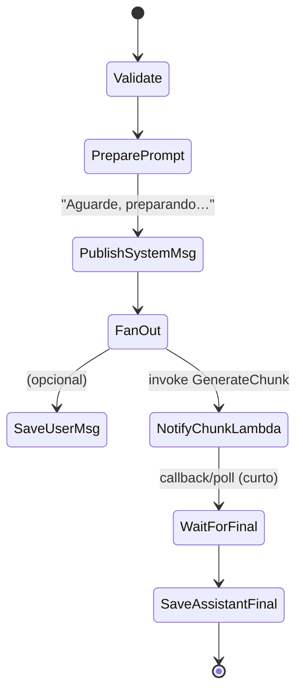

# Orchestration (AWS Step Functions)

> Camada de **orquestração** da AletheIA para coordenar a preparação de prompts, envio de mensagens via WebSocket e persistência de histórico. Usa **AWS Step Functions** (ASL) com tarefas Lambda e integrações nativas da AWS.

---

## 🎯 Objetivos

* **Separar controle de fluxo** da lógica de negócio das Lambdas.
* Garantir **resiliência** (retries exponenciais, timeouts, *circuit breakers* simples).
* Facilitar **auditoria e observabilidade** (histórico de execuções, *input/output* por etapa, métricas).
* Habilitar **macro‑orquestrações** (p.ex., pós‑processamento, fan‑out, integração com terceiros).

> **Nota**: O **streaming** token‑a‑token continua sendo responsabilidade da Lambda `GenerateChunk` (latência crítica). A orquestração foca no **pré/pós**: preparo de prompt, mensagens sistêmicas, persistência, *side effects* e governança.

---

## 📁 Estrutura

```
services/orchestration/
├─ README.md              # este arquivo
├─ WebSocketResponder.json# definição ASL (exemplo de state machine)
└─ tests/                 # testes de orquestração (recom.: ASL + mocks de Lambda)
```

* **`WebSocketResponder.json`**: *state machine* exemplo para publicação segura de mensagens no canal WebSocket, com retries e trilha de auditoria.

---

## 🔌 Contratos de I/O (padrão)

### Evento de entrada (exemplo)

```json
{
  "correlationId": "conv-uuid",
  "connectionId": "abc123=",
  "sequence": 21,
  "user": { "text": "Explique o erro X" },
  "context": { "history": [] },
  "flags": { "save": true, "notify": true },
  "llm": { "provider": "openai", "model": "gpt-4o-mini" }
}
```

### Saídas esperadas por etapa

* **PreparePrompt** → `{ prepared: { system, user, history, composite, budget, safety, lang } }`
* **Publish\:System** → `chunk|system` no WS (ex.: "processando…").
* **GenerateChunk (stream)** → mensagens `chunk` e `final` direto ao WS (**fora da SFN**).
* **SaveChatHistory** → persistência da mensagem final (e opcionalmente da entrada).

> **IDs e ordenação**: use sempre `correlationId`, `messageId`, `sequence` e `chunkIndex` conforme os contratos definidos pelo chat‑stream.

---

## 🧭 Fluxo de referência



* **Validate**: saneia *input* e rejeita payloads inválidos.
* **PreparePrompt**: invoca `services/chat-stream/src/PreparePrompt.js`.
* **PublishSystemMsg**: envia atualização curta ao cliente via WS (ex.: *typing*).
* **NotifyChunkLambda**: invoca `GenerateChunk` de forma assíncrona (streaming direto Lambda→WS).
* **WaitForFinal**: espera **curta** (poll/evento) apenas para acoplar o pós‑processo; evite aguardar toda a conversa.
* **SaveAssistantFinal**: chama `SaveChatHistory` com a mensagem final, custos/uso, `promptSource` etc.

> **Por quê não stream pela SFN?** O Step Functions não é otimizado para baixa latência por chunk. Centralize o stream na Lambda e use a SFN para governança.

---

## 🧩 Definição ASL (padrão de projeto)

Abaixo um **esqueleto** de *state machine* (similar ao `WebSocketResponder.json`) que cobre validação, preparo, publicação e persistência. Adapte ARNs via Terraform.

```json
{
  "Comment": "AletheIA — Orchestration (Prepare → Publish:System → Notify GenerateChunk → SaveFinal)",
  "StartAt": "Validate",
  "States": {
    "Validate": {
      "Type": "Pass",
      "ResultPath": "$.meta.validate",
      "Next": "PreparePrompt"
    },
    "PreparePrompt": {
      "Type": "Task",
      "Resource": "arn:aws:states:::lambda:invoke",
      "Parameters": {
        "FunctionName": "${PreparePromptLambdaArn}",
        "Payload.$": "$"
      },
      "ResultSelector": { "prepared.$": "$.Payload.prepared" },
      "ResultPath": "$.prepared",
      "Retry": [
        {"ErrorEquals": ["Lambda.ServiceException","Lambda.AWSLambdaException","Lambda.SdkClientException"], "IntervalSeconds": 1, "MaxAttempts": 2, "BackoffRate": 2.0}
      ],
      "Catch": [ {"ErrorEquals": ["States.ALL"], "ResultPath": "$.error.prepare", "Next": "PublishError"} ],
      "Next": "PublishSystemMsg"
    },
    "PublishSystemMsg": {
      "Type": "Task",
      "Resource": "arn:aws:states:::lambda:invoke",
      "Parameters": {
        "FunctionName": "${WebSocketResponderLambdaArn}",
        "Payload": {
          "messageType": "system",
          "payload": { "text": "Processando…" },
          "connectionId.$": "$.connectionId",
          "correlationId.$": "$.correlationId",
          "sequence.$": "$.sequence"
        }
      },
      "ResultPath": "$.meta.publishSystem",
      "Retry": [ {"ErrorEquals": ["States.ALL"], "IntervalSeconds": 1, "MaxAttempts": 3, "BackoffRate": 2.0} ],
      "Catch": [ {"ErrorEquals": ["States.ALL"], "ResultPath": "$.error.publishSystem", "Next": "NotifyChunkLambda"} ],
      "Next": "NotifyChunkLambda"
    },
    "NotifyChunkLambda": {
      "Type": "Task",
      "Resource": "arn:aws:states:::lambda:invoke",
      "Parameters": {
        "FunctionName": "${GenerateChunkLambdaArn}",
        "Payload.$": "$"
      },
      "ResultPath": "$.meta.generate",
      "Catch": [ {"ErrorEquals": ["States.ALL"], "ResultPath": "$.error.generate", "Next": "PublishError"} ],
      "Next": "SaveAssistantFinal"
    },
    "SaveAssistantFinal": {
      "Type": "Task",
      "Resource": "arn:aws:states:::lambda:invoke",
      "Parameters": {
        "FunctionName": "${SaveChatHistoryLambdaArn}",
        "Payload": {
          "messages": [
            {
              "messageType": "assistant",
              "role": "assistant",
              "isFinal": true,
              "correlationId.$": "$.correlationId",
              "conversationId.$": "$.correlationId",
              "sequence.$": "$.sequence",
              "text.$": "$.meta.generate.Payload.payload.text",
              "usage.$": "$.meta.generate.Payload.payload.usage",
              "costEstimateUSD.$": "$.meta.generate.Payload.payload.costEstimateUSD",
              "provider.$": "$.llm.provider",
              "model.$": "$.llm.model",
              "promptSource.$": "$.prepared.budget ? 'prepared' : 'local'"
            }
          ]
        }
      },
      "ResultPath": "$.meta.saveFinal",
      "Catch": [ {"ErrorEquals": ["States.ALL"], "ResultPath": "$.error.saveFinal", "Next": "PublishError"} ],
      "End": true
    },
    "PublishError": {
      "Type": "Task",
      "Resource": "arn:aws:states:::lambda:invoke",
      "Parameters": {
        "FunctionName": "${WebSocketResponderLambdaArn}",
        "Payload": {
          "messageType": "error",
          "payload": { "text": "Ocorreu um erro. Tente novamente." },
          "connectionId.$": "$.connectionId",
          "correlationId.$": "$.correlationId",
          "sequence.$": "$.sequence"
        }
      },
      "ResultPath": "$.meta.publishError",
      "End": true
    }
  }
}
```

> ⚠️ **Importante**: acima é um **padrão**; adapte conforme o seu `WebSocketResponder.json` e o desenho final (ex.: se `GenerateChunk` não retornar corpo por ser *fire‑and‑forget*, mova `SaveAssistantFinal` para um *trigger* externo).

---

## 🔐 IAM e segurança

* Crie **roles distintas** para cada Lambda e **uma role** para a SFN com permissões **mínimas**:

  * `lambda:InvokeFunction` **apenas** para as funções chamadas.
  * `states:StartExecution` (se acionada por outras Lambdas/EventBridge).
  * Acesso **somente leitura** a Segredos/Parâmetros se necessário em *Parameters*.
* Propague `correlationId` em **todos** os logs para rastreabilidade fim‑a‑fim.

---

## ⏱️ Timeouts, retries e limites

* **Timeout** por estado ≤ 30s (recomendado) e **tempo total** da *state machine* ≤ 2–3 min.
* **Retry** exponencial nas integrações remotas; use `Catch` central para enviar `PublishError`.
* Evite laços de espera longos na SFN (custos). Para long‑running, prefira **EventBridge** + *callbacks*.

---

## 📈 Observabilidade

* **CloudWatch Logs**: habilite `IncludeExecutionData` para *input/output* (cautela com PII).
* **Métricas custom** (EMF) por etapa importante (ex.: tempo `PreparePrompt`, taxa de falhas, custo estimado agregado).
* **X‑Ray** (opcional) nas Lambdas, com `correlationId` em **annotations**.

---

## 🚀 Deploy (Terraform + GitHub Actions)

* Declare a *state machine* como **recurso Terraform** (ASL em arquivo local versionado).
* Use **OIDC** no GitHub Actions para `plan/apply` (ver `infra/terraform` e workflows `tf-apply.yml`).
* Parametrize ARNs das Lambdas (`PreparePrompt`, `GenerateChunk`, `SaveChatHistory`, `WebSocketResponder`).

Exemplo de variável Terraform (trecho):

```hcl
variable "orchestration_asl_path" { type = string }
resource "aws_sfn_state_machine" "aletheia" {
  name     = "aletheia-orchestration"
  role_arn = aws_iam_role.sfn_exec.arn
  definition = file(var.orchestration_asl_path)
}
```

---

## 🧪 Testes locais

### Step Functions Local (Docker)

```
docker run -it --rm -p 8083:8083 -e AWS_DEFAULT_REGION=us-east-1 amazon/aws-stepfunctions-local
```

* Exporte a ASL, crie a máquina localmente via AWS CLI apontando para o endpoint local.
* Para mocks, use **Lambda local** ou *stubs* HTTP.

### Sugestões de cenários

* **Feliz**: prepara, publica sistema, aciona `GenerateChunk` (simulado), salva final.
* **Erro Prepare**: cai em `PublishError`.
* **Erro Publish**: reintenta 3x e segue fluxo para `GenerateChunk`.
* **Timeout Generate**: `WaitForFinal` expira → `PublishError`.

---

## 🗺️ Decisões (resumo)

* **Streaming** fica na Lambda; SFN governa pré/pós (latência e custos).
* **Contratos** explícitos em JSON com `correlationId/sequence`.
* **Idempotência** e ordenação na persistência (`SaveChatHistory`).

> Detalhes completos e ADRs em `docs/architecture/`.

---

## 🔮 Próximos passos

* **Callback pattern** via `Task Token` para aguardar *final* de forma assíncrona.
* **Fan‑out** para enriquecimentos (ex.: sumarização, rotulagem, métricas de qualidade).
* **Quotas** e *rate limiting* por usuário/e‑mail (Step Functions + DynamoDB token bucket).
* **Choreography** por **EventBridge** quando houver múltiplos produtores/consumidores.
